# Create Knowledge Buddy - Workflow Diagram

```mermaid
flowchart TD
    Start([Start]) --> Step0[Step 0: Verify Pega Connection]
    Step0 --> Step1[Step 1: Create Case]

    Step1 --> Step2{Step 2: Clone or New?}

    Step2 -->|Yes, Clone| QueryClone[Query D_OriginalBuddyList]
    QueryClone --> Step3a[Step 3a: Gather Input for Cloning<br/>Name + Description + Clone Source]

    Step2 -->|No, New| Step3b[Step 3b: Gather Input for New<br/>Name + Description]

    Step3a --> Step4[Step 4: Submit Create Action & Refresh<br/>Transition: Create → Secure]
    Step3b --> Step4

    Step4 --> Step5{Step 5: Access Control?}

    Step5 -->|Default| Step5a[Use Default Access<br/>2 configs: Admin manage, Public use]

    Step5 -->|Custom| QueryRoles[Query D_BuddyAccessRoleList]
    QueryRoles --> Step5b[Step 5a: Configure Custom Access<br/>Ask count, type, roles for each]

    Step5a --> Step6[Step 6: Submit Security Assignment<br/>Transition: Secure → Prompt]
    Step5b --> Step6

    Step6 --> Step7[Step 7: Configure Prompts<br/>Ask: Default or Custom Instructions<br/>Ask: Default or Custom Information]

    Step7 --> Step8{Step 8: Context Data?}

    Step8 -->|Use Defaults| Step8a[Use Default SEARCHRESULTS<br/>Empty collection, default settings]

    Step8 -->|Edit SEARCHRESULTS| QueryCollections1[Query D_IndexList]
    QueryCollections1 --> QuerySources1[Query D_DataSourceListByCollection<br/>Query D_AttributeList]
    QuerySources1 --> Step8b[Step 8a: Edit Default SEARCHRESULTS<br/>Select collection, sources, attributes]

    Step8 -->|Add Custom Contexts| QueryCollections2[Query D_IndexList]
    QueryCollections2 --> Step8c1{Keep or Edit<br/>SEARCHRESULTS?}
    Step8c1 -->|Keep Defaults| Step8c2[Ask: How many contexts?]
    Step8c1 -->|Edit It| EditSR[Edit SEARCHRESULTS]
    EditSR --> Step8c2
    Step8c2 --> Step8c3[Step 8b: For Each Context<br/>Name, Collection, Sources, Attributes]

    Step8a --> Step9{Step 9: GenAI Model?}
    Step8b --> Step9
    Step8c3 --> Step9

    Step9 -->|Use Default| Step9a[Use Default Model<br/>Empty ModelId<br/>Ask: Text replacements?<br/>Ask: Auto filtering?]

    Step9 -->|Select Model| QueryModels[Query D_bxGenAIModelsForBuddy]
    QueryModels --> Step9b[Step 9a: Select Model<br/>Ask: Model selection<br/>If GPT: Ask output format<br/>Ask: Text replacements?<br/>Ask: Auto filtering?]

    Step9a --> Step10[Step 10: Submit Prompt Assignment<br/>Combine: Prompts + Context + GenAI<br/>Auto-resolve: Prompt → Resolve]
    Step9b --> Step10

    Step10 --> Step11[Step 11: Verify Success<br/>Check: Resolved-Completed<br/>Report: Case ID & URL]

    Step11 --> End([End])

    style Start fill:#e1f5e1
    style End fill:#e1f5e1
    style Step2 fill:#fff4e1
    style Step5 fill:#fff4e1
    style Step8 fill:#fff4e1
    style Step8c1 fill:#fff4e1
    style Step9 fill:#fff4e1
    style Step10 fill:#e1e5ff
    style Step11 fill:#e1e5ff
```

## Workflow Summary

### Key Decision Points

1. **Clone or New** (Step 2)
   - Clone: Query existing buddies → 3 inputs
   - New: 2 inputs only

2. **Access Control** (Step 5)
   - Default: Keep 2 default configs
   - Custom: Dynamic number with specific roles

3. **Context Data** (Step 8)
   - Use Defaults: Empty SEARCHRESULTS
   - Edit SEARCHRESULTS: Customize default context
   - Add Custom: Multiple contexts with configuration

4. **GenAI Model** (Step 9)
   - Default: Empty ModelId, basic settings
   - Select Model: Choose specific model, advanced settings

### Path Complexity

- **Simplest Path**: New → Default → Default → Default → Default
  - 6 main steps with minimal questions

- **Most Complex Path**: Clone → Custom → Edit/Add → Select Model
  - 11 main steps with multiple sub-questions

### Atomic Reference Files

Each decision point branches to atomic reference files:
- **02a/02b**: Clone vs New input
- **04a/04b**: Default vs Custom access
- **06a/06b/06c**: Default vs Edit vs Add contexts
- **07a/07b**: Default vs Custom GenAI model
